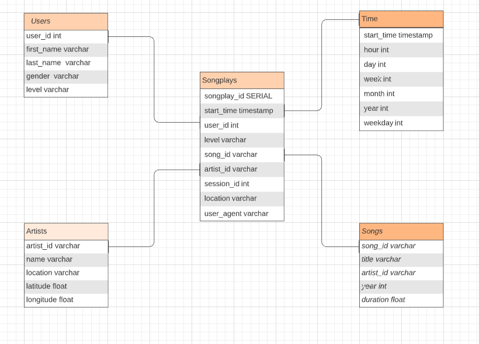

##### Purpose 

Sparkify is startup want to put to use the data collected from their new music streaming app into meanigful insights. A database where all the data in combined and cleaned is needed to optimize queries on song play analysis.Song analysis will provide a better experience for the user and make the app reach more music fans.

##### Tables structure

**songplays** - songplay_id, start_time, user_id, level, song_id, artist_id, session_id, location, user_agent

**users** - user_id, first_name, last_name, gender, level
**songs** - song_id, title, artist_id, year, duration
**artists** - artist_id, name, location, latitude, longitude
**time** - start_time, hour, day, week, month, year, weekday

**Star Schema** is used in this project for its simplicity, the ability to simplify queries and fast aggregation, 
*Fact table*: songplays
*Dimension tables*: users, songs, artists, time

##### Queries
- Songs played count by Hour 
    `SELECT EXTRACT(HOUR FROM start_time) AS hour , COUNT(*) FROM songplays GROUP BY 1 ORDER BY hour`
    
| hour  | 0   | 1   | 2   | 3   | 4   | 5   | 6   | 7   | 8   | 9   | 10  | 11  | 12  | 13  | 14  | 15  | 16  | 17  | 18  | 19  | 20  | 21  | 22  | 23  |
|-------|-----|-----|-----|-----|-----|-----|-----|-----|-----|-----|-----|-----|-----|-----|-----|-----|-----|-----|-----|-----|-----|-----|-----|-----|
| count | 155 | 154 | 117 | 109 | 136 | 162 | 183 | 179 | 207 | 270 | 312 | 336 | 308 | 324 | 432 | 477 | 542 | 494 | 498 | 367 | 360 | 280 | 217 | 201 |

- Songs played count by Day of Week (0: sunday)
    `SELECT EXTRACT(dow FROM start_time) AS day , COUNT(*) FROM songplays GROUP BY 1 ORDER BY day`
    
| day | count |
|----:|------:|
|   0 |   396 |
|   1 |  1014 |
|   2 |  1071 |
|   3 |  1364 |
|   4 |  1052 |
|   5 |  1295 |
|   6 |   628 |

- Songs played count by Gender
    `SELECT gender , COUNT(*) FROM songplays JOIN users ON users.user_id = songplays.user_id GROUP BY 1`

| gender |   count |
|-------:|--------:|
|      M |  340803 |
|      F | 1978297 |